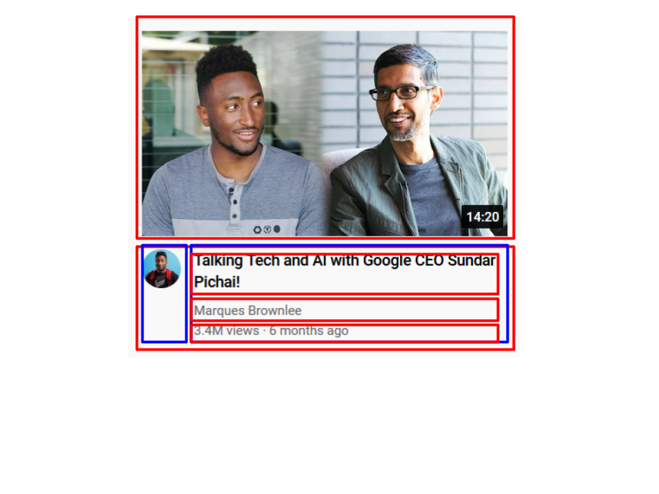

# Intro
It's notes from [this](https://www.youtube.com/watch?v=G3e-cpL7ofc) course.

## Syllabus
Complete Course

## 1 HTML Basics
- What is HTML?
- How it process tags?
- What is html element?
    - tag
        - opening and closing
        - attributes="value"
    - content
- Extra spaces and new lines ignored => organizing code
- List of elements
    - p, button
    - a [href, target(_blank, "")]

## 2 CSS Basics
- Example of creating button from popular websites with css
- Algorithm: Create element - Set styles 1 by 1
- CSS Rule Syntax (Selector, Property, Value)
    - selector by .class
    - selector by element
- Margin - space between elements
- Color Picker rgb(r, g, b) or rgba(r, g, b, a)
- List of elements
    - style
- Class attribute
- List of properties
    - background-color
    - color
    - border (none)
    - border-radius (px)
    - border-style (solid)
    - border-width (px)
    - cursor (pointer)
    - height (px)
    - width (px)
    - margin-right (px)
    - margin-left
    - font-weight (bold)
    - font-size (px)

## 3 Hover, Transitions, Shadows
- Pseudo-class
    - hover, active
- Transition to the base style (when active and when not)
- rgba values for colors with opacity
- List of CSS properties
    - opacity (0-1)
    - transition (property time, ...) ~ 0.15s
    - box-shadow (hor vert blur color)

## 4 DevTools + CSS Box Model
- Content, padding(inside), border, margin(outside)
    - instead of height and width it's better to use paddings
- Dev Tools
    - Computed styles
- Aligning
- transition: padding applies to any padding-left right etc.
- List of CSS properties
    - padding-top, bottom, left, right
        - padding (all, ver hor, top right bottom left)
    - margin-top, bottom, left, rigth
    - vertical-align (top) - by text default

## 5 Text Styles
- List of elements
    - p - default vertical margin
    - text - elements
        - strong
        - u - underlined
        - span - no styles. to style ourselves
            - multiple space with margin-left
- resetting default margins
- Style overriding, several rules for one element
    - Specificity
    - Selector (element < class < id, )
- **HTML entity** - special characters (google)
    - middle dot -> &#183
    - checkmark -> &#10003
    - for > < to not confuse with tags
- width for multiline paragraph
- List of CSS properties
    - font-family (Arial)
    - font-size (px)
    - font-weight (bold)
    - font-style (italic, normal)
    - text-align (center)
    - line-height (px)
    - color
    - text-decoration (underline, overline)

## 6 The HTML structure
- Structure
    0. `<!DOCTYPE html>`
    1. `html`
        1. `head` - meta info
            - `title`, `style`, `link` 
        2. `body` - visible
- Separate CSS files: `<link rel="stylesheet" href="*.css">` inside the head tag.
- Absolute and relative paths
- void elements - don't need a closing tag
- Nesting - elements hierarchy. DOM.
- Live Server extension for vs code
    - windows preview
- Adding a font - google fonts (roboto) - link this fonts in head section!
    - go to google fonts and select needed font. Get font code and add to head tag.
- List of Elements
    - html
    - head
        - title
        - link [rel(stylesheet), href(address)]
        - style
    - body

## 7 Images and Text Boxes
- Youtube start
    - structure
    - title
    - image and its styling
        - width, height - stretching
- Image element
- Search box
    - input
- List of elements
    - img [src(path), ]
    - input [type(text, checkbox), placeholder(anyval)]
- List of properties
    - img
        - object-fit (cover, contain)
        - object-position (left, right, top, bottom)
    - vertical-align (middle)

## 8 CSS Display property
- Types of elements
    - block element - entire line
        - p
    - inline-block element - as much space as needed
        - img, input
    - inline - text elements
- Display property - how elements are placed on the page
- **DOCTYPE influecnes the sizes with paddings**
    - Quirks or standard mode of rendering the page
- List of properties
    - display (block, inline-block, inline)

## 9 div element
- div - division (box)
    - for grouping elements (containers)
- Creating container for video preview.
    - adding the second video preview in the same line
    - alignment
- block element - entire line in their container! - that's why divs useful
- list of properties
    - vertical-align (top)
    - text-align (center) to center inline-block elements inside div

## 10 Nested Layout Techniques (MOST IMPORTANT)
- 2 types -> nested
    - Vertical
    - Horizontal
- google drawings
- Break down designs using technique
    - **Recreating using code**
        - Vertical - block divs
        - horizontal - divs - inline blocks!
- **Images by default overflow** - resize
    - % size to took space in container (100%)
- Create layout -> style one by one
- Roboto Font, Font Stack

## 11 CSS Grid
- inline block aligning problems (whitespace)
    - not vertically aligned
- style attribute of html tag (Inline styles)
- Grid - layout that have rows and columns
    - grid property works with container
    - `display: grid`
    - `grid-template-columns: 100px 100px` - how wide columns are and how many columns
    - Elements inside the grid are place into grid cells
    - Grids maintain alignment
    - New rows are created if there is more elements
    - `1fr` value for column - remaining space
        - two columns with `1fr` same size
        - the number says the proportion (1fr 2fr) means the second column will be 2 times bigger
    - `column-gap`
    - `row-gap`
    - `align-items`

## 12 Flexbox
- Similar to grid but more flexible
    - display (flex)
    - flex-direction (row)
    - `flex (1, 2 etc)` - same as 1fr. Value = proportion
    - vertically aligned
        - align-items
            - stretch
            - start end center
    - justify-content - horizontal aligment
        - start, end, center
        - space-between
        - space
- Differences with grid
    - if we change order - layout will change (in grid you need to change template)
- If layout more flexible (depending on content) - flexbox better choice
- Creating header
- Organizing css files related to different entities
- **default margin of body tag**
- List Of Properties
    - max-width

## 13 Nested Flexbox
- Download all icons and images on header
- flexbox works only for children level -> so we need nested flexboxes for more complicated designs.
- Pseudo elements
    - `::placeholder`
- negative spacing to make elements sticky
- default width of textbox input -> width 0
- List of properties
    - flex-direction: row - default
    - box-shadow (inset - inside)
    - flex-shrink (0) - won't be shrinked flexbox width the same
    - overflow (hidden)

## 14 CSS Position
- Any element on top of other element
- Elements with fixed position (like header)
- Position
    - static - default
    - fixed - doesn't take any space. Floats above.
        - top, bottom, left, right, inset properties to define position
        - Stretching if opposite directions
        - relative to window
        - Example with header
            - **to not cover content - body padding-top!**
        - Setting youtube project header
        - Sidebar example
            - extra space on the left side
- List of properties
    - side border (border-bottom-width)

## 15 CSS Position Relative and Absolute
- Position
    - absolute - placed element relative to ancestor element with fixed position (or on the page)
        - left top bottom right inset
        - fixed - in the window
        - Example of attaching to corners of elements
    - relative - same as static BUT absolute position takes it as ancestor
        - relative + absolute inside to create elements inside elements
- Adding video times to videos
    - img not container so at parent div
- adding notification count
- Position static is at the back
    - position absolute, relative going to top. so we need to define z-index to them
- Element below is higher
    - z-index (0) default
- Making inline block to shring element.

## 16 Finish Project
- Sidebar
- Seletor types
    - element
    - type
    - combine
        - several selectors
        - descedant selector
        - child selector
- Modifying video
- tooltips with transition
    - pointer-events none
        - disabling hovering on tooltip
    - whitespace nowrap! property
    - opacity
- List of properties